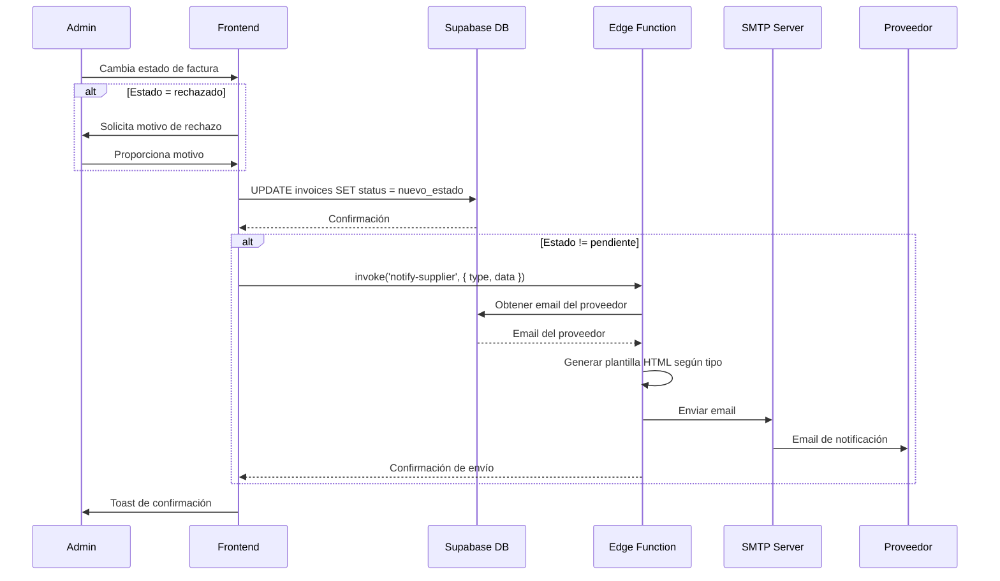

# Sistema de Notificación de Cambio de Estado de Facturas

## Descripción General

Sistema automatizado de notificaciones por correo electrónico que informa a los proveedores sobre los cambios de estado de sus facturas. Cuando un administrador actualiza el estado de una factura (procesando, pagado o rechazado), el sistema envía automáticamente un correo electrónico personalizado al proveedor.

## Estados de Factura que Envían Notificación

| Estado | Descripción | Plantilla de Email |
|--------|-------------|-------------------|
| `procesando` | La factura está siendo procesada para pago | Email azul con timeline |
| `pagado` | El pago ha sido completado | Email verde con confirmación |
| `rechazado` | La factura fue rechazada | Email rojo con motivo |
| `pendiente` | Estado inicial (NO envía email) | - |

## Arquitectura del Sistema

### 1. Tipos de Notificación (useNotifications.tsx)

```typescript
type NotificationType = 
  | 'invoice_status_processing'  // Factura en procesamiento
  | 'invoice_status_paid'        // Factura pagada
  | 'invoice_status_rejected';   // Factura rechazada
```

### 2. Hook de Notificaciones

**Archivo:** `src/hooks/useNotifications.tsx`

```typescript
export const useNotifications = () => {
  const notifySupplier = async (
    supplierId: string,
    type: NotificationType,
    data?: any
  ) => {
    try {
      const { error } = await supabase.functions.invoke("notify-supplier", {
        body: {
          supplier_id: supplierId,
          type,
          data,
        },
      });

      if (error) {
        console.error("Error sending supplier notification:", error);
        throw error;
      }
    } catch (error) {
      console.error("Failed to notify supplier:", error);
    }
  };

  return {
    notifySupplier,
    notifyAdmin,
  };
};
```

### 3. Actualización de Estado con Notificación

**Archivo:** `src/pages/Invoices.tsx`

#### Mutación de Actualización

```typescript
const updateStatusMutation = useMutation({
  mutationFn: async ({ 
    invoice, 
    newStatus, 
    rejectionReason 
  }: { 
    invoice: any; 
    newStatus: string; 
    rejectionReason?: string;
  }) => {
    const { error } = await supabase
      .from("invoices")
      .update({ 
        status: newStatus,
        ...(newStatus === 'rechazado' && rejectionReason 
          ? { notes: rejectionReason } 
          : {})
      })
      .eq("id", invoice.id);

    if (error) throw error;

    // Enviar notificación por email según el estado
    if (newStatus === 'procesando') {
      await notifySupplier(
        invoice.supplier_id,
        'invoice_status_processing',
        {
          invoice_number: invoice.invoice_number,
          amount: invoice.amount,
          currency: invoice.currency,
        }
      );
    } else if (newStatus === 'pagado') {
      await notifySupplier(
        invoice.supplier_id,
        'invoice_status_paid',
        {
          invoice_number: invoice.invoice_number,
          amount: invoice.amount,
          currency: invoice.currency,
          payment_date: new Date().toISOString(),
        }
      );
    } else if (newStatus === 'rechazado' && rejectionReason) {
      await notifySupplier(
        invoice.supplier_id,
        'invoice_status_rejected',
        {
          invoice_number: invoice.invoice_number,
          amount: invoice.amount,
          currency: invoice.currency,
          rejection_reason: rejectionReason,
        }
      );
    }

    return { invoice, newStatus };
  },
  onSuccess: () => {
    queryClient.invalidateQueries({ queryKey: ["invoices"] });
    toast.success("Estado actualizado correctamente");
  },
});
```

#### Componente de Selección de Estado

```typescript
<Select
  value={invoice.status}
  onValueChange={(value) => {
    if (value === 'rechazado') {
      // Solicitar motivo de rechazo
      const reason = prompt('Ingrese el motivo del rechazo:');
      if (reason) {
        updateStatusMutation.mutate({ 
          invoice, 
          newStatus: value,
          rejectionReason: reason
        });
      }
    } else {
      updateStatusMutation.mutate({ 
        invoice, 
        newStatus: value 
      });
    }
  }}
>
  <SelectTrigger>
    <SelectValue />
  </SelectTrigger>
  <SelectContent>
    <SelectItem value="pendiente">Pendiente</SelectItem>
    <SelectItem value="procesando">Procesando</SelectItem>
    <SelectItem value="pagado">Pagado</SelectItem>
    <SelectItem value="rechazado">Rechazado</SelectItem>
  </SelectContent>
</Select>
```

## Plantillas de Email

**Archivo:** `supabase/functions/notify-supplier/index.ts`

### 1. Email - Factura en Procesamiento

```typescript
case 'invoice_status_processing':
  subject = `Factura ${data.invoice_number} - En Procesamiento`;
  htmlContent = `
    <div style="font-family: Arial, sans-serif; max-width: 600px; margin: 0 auto; padding: 20px; background-color: #f5f5f5;">
      <div style="background: linear-gradient(135deg, #667eea 0%, #764ba2 100%); padding: 30px; border-radius: 10px 10px 0 0; text-align: center;">
        <h1 style="color: white; margin: 0; font-size: 28px;">⏳ Factura en Procesamiento</h1>
      </div>
      
      <div style="background-color: white; padding: 30px; border-radius: 0 0 10px 10px; box-shadow: 0 4px 6px rgba(0,0,0,0.1);">
        <p style="font-size: 16px; color: #333; margin-bottom: 20px;">
          Estimado proveedor,
        </p>
        
        <p style="font-size: 16px; color: #333; margin-bottom: 25px;">
          Su factura está siendo procesada para pago.
        </p>

        <div style="background-color: #f0f4ff; padding: 20px; border-radius: 8px; margin-bottom: 25px; border-left: 4px solid #667eea;">
          <h3 style="margin: 0 0 15px 0; color: #667eea; font-size: 18px;">📄 Detalles de la Factura</h3>
          <table style="width: 100%; border-collapse: collapse;">
            <tr>
              <td style="padding: 8px 0; color: #666; font-weight: bold;">Número de Factura:</td>
              <td style="padding: 8px 0; color: #333; text-align: right;">${data.invoice_number}</td>
            </tr>
            <tr>
              <td style="padding: 8px 0; color: #666; font-weight: bold;">Monto:</td>
              <td style="padding: 8px 0; color: #333; text-align: right; font-size: 20px; font-weight: bold;">
                ${new Intl.NumberFormat('es-MX', { 
                  style: 'currency', 
                  currency: data.currency || 'MXN' 
                }).format(data.amount)}
              </td>
            </tr>
          </table>
        </div>

        <div style="background-color: #fff3cd; padding: 20px; border-radius: 8px; margin-bottom: 25px; border-left: 4px solid #ffc107;">
          <h3 style="margin: 0 0 15px 0; color: #856404; font-size: 16px;">📋 Proceso de Pago</h3>
          <div style="position: relative; padding-left: 30px;">
            <div style="position: absolute; left: 0; top: 0; bottom: 0; width: 2px; background: linear-gradient(to bottom, #28a745, #ffc107, #dc3545);"></div>
            <div style="margin-bottom: 15px; position: relative;">
              <div style="position: absolute; left: -36px; width: 12px; height: 12px; background-color: #28a745; border-radius: 50%; border: 3px solid white; box-shadow: 0 0 0 2px #28a745;"></div>
              <strong style="color: #28a745;">✓ Factura recibida</strong>
            </div>
            <div style="margin-bottom: 15px; position: relative;">
              <div style="position: absolute; left: -36px; width: 12px; height: 12px; background-color: #ffc107; border-radius: 50%; border: 3px solid white; box-shadow: 0 0 0 2px #ffc107;"></div>
              <strong style="color: #ffc107;">▶ Procesando pago (actual)</strong>
            </div>
            <div style="position: relative;">
              <div style="position: absolute; left: -36px; width: 12px; height: 12px; background-color: #6c757d; border-radius: 50%; border: 3px solid white; box-shadow: 0 0 0 2px #6c757d;"></div>
              <span style="color: #6c757d;">○ Pago completado</span>
            </div>
          </div>
        </div>

        <p style="font-size: 14px; color: #666; margin-top: 30px; padding-top: 20px; border-top: 1px solid #eee;">
          Le notificaremos una vez que el pago haya sido completado.
        </p>
      </div>
    </div>
  `;
  break;
```

### 2. Email - Factura Pagada

```typescript
case 'invoice_status_paid':
  subject = `✅ Factura ${data.invoice_number} - Pago Completado`;
  htmlContent = `
    <div style="font-family: Arial, sans-serif; max-width: 600px; margin: 0 auto; padding: 20px; background-color: #f5f5f5;">
      <div style="background: linear-gradient(135deg, #11998e 0%, #38ef7d 100%); padding: 30px; border-radius: 10px 10px 0 0; text-align: center;">
        <h1 style="color: white; margin: 0; font-size: 28px;">✅ Pago Completado</h1>
      </div>
      
      <div style="background-color: white; padding: 30px; border-radius: 0 0 10px 10px; box-shadow: 0 4px 6px rgba(0,0,0,0.1);">
        <div style="text-align: center; padding: 20px 0;">
          <div style="display: inline-block; background-color: #d4edda; border-radius: 50%; width: 80px; height: 80px; line-height: 80px; margin-bottom: 20px;">
            <span style="color: #28a745; font-size: 50px;">✓</span>
          </div>
        </div>

        <p style="font-size: 16px; color: #333; margin-bottom: 20px;">
          Estimado proveedor,
        </p>
        
        <p style="font-size: 16px; color: #333; margin-bottom: 25px;">
          ¡Excelentes noticias! Su factura ha sido pagada exitosamente.
        </p>

        <div style="background-color: #d4edda; padding: 20px; border-radius: 8px; margin-bottom: 25px; border-left: 4px solid #28a745;">
          <h3 style="margin: 0 0 15px 0; color: #28a745; font-size: 18px;">💰 Detalles del Pago</h3>
          <table style="width: 100%; border-collapse: collapse;">
            <tr>
              <td style="padding: 8px 0; color: #666; font-weight: bold;">Número de Factura:</td>
              <td style="padding: 8px 0; color: #333; text-align: right;">${data.invoice_number}</td>
            </tr>
            <tr>
              <td style="padding: 8px 0; color: #666; font-weight: bold;">Monto Pagado:</td>
              <td style="padding: 8px 0; color: #28a745; text-align: right; font-size: 24px; font-weight: bold;">
                ${new Intl.NumberFormat('es-MX', { 
                  style: 'currency', 
                  currency: data.currency || 'MXN' 
                }).format(data.amount)}
              </td>
            </tr>
            <tr>
              <td style="padding: 8px 0; color: #666; font-weight: bold;">Fecha de Pago:</td>
              <td style="padding: 8px 0; color: #333; text-align: right;">
                ${new Date(data.payment_date).toLocaleDateString('es-MX', {
                  year: 'numeric',
                  month: 'long',
                  day: 'numeric'
                })}
              </td>
            </tr>
          </table>
        </div>

        <div style="background-color: #e7f3ff; padding: 20px; border-radius: 8px; margin-bottom: 25px; border-left: 4px solid #007bff;">
          <p style="margin: 0; color: #004085; font-size: 14px;">
            <strong>📌 Nota:</strong> El pago se reflejará en su cuenta bancaria en los próximos días hábiles según los tiempos de procesamiento de su institución financiera.
          </p>
        </div>

        <p style="font-size: 14px; color: #666; margin-top: 30px; padding-top: 20px; border-top: 1px solid #eee;">
          Gracias por su colaboración.
        </p>
      </div>
    </div>
  `;
  break;
```

### 3. Email - Factura Rechazada

```typescript
case 'invoice_status_rejected':
  subject = `❌ Factura ${data.invoice_number} - Rechazada`;
  htmlContent = `
    <div style="font-family: Arial, sans-serif; max-width: 600px; margin: 0 auto; padding: 20px; background-color: #f5f5f5;">
      <div style="background: linear-gradient(135deg, #ee0979 0%, #ff6a00 100%); padding: 30px; border-radius: 10px 10px 0 0; text-align: center;">
        <h1 style="color: white; margin: 0; font-size: 28px;">❌ Factura Rechazada</h1>
      </div>
      
      <div style="background-color: white; padding: 30px; border-radius: 0 0 10px 10px; box-shadow: 0 4px 6px rgba(0,0,0,0.1);">
        <p style="font-size: 16px; color: #333; margin-bottom: 20px;">
          Estimado proveedor,
        </p>
        
        <p style="font-size: 16px; color: #333; margin-bottom: 25px;">
          Lamentamos informarle que su factura ha sido rechazada.
        </p>

        <div style="background-color: #fff3cd; padding: 20px; border-radius: 8px; margin-bottom: 25px; border-left: 4px solid #ffc107;">
          <h3 style="margin: 0 0 15px 0; color: #856404; font-size: 18px;">📄 Detalles de la Factura</h3>
          <table style="width: 100%; border-collapse: collapse;">
            <tr>
              <td style="padding: 8px 0; color: #666; font-weight: bold;">Número de Factura:</td>
              <td style="padding: 8px 0; color: #333; text-align: right;">${data.invoice_number}</td>
            </tr>
            <tr>
              <td style="padding: 8px 0; color: #666; font-weight: bold;">Monto:</td>
              <td style="padding: 8px 0; color: #333; text-align: right; font-size: 20px; font-weight: bold;">
                ${new Intl.NumberFormat('es-MX', { 
                  style: 'currency', 
                  currency: data.currency || 'MXN' 
                }).format(data.amount)}
              </td>
            </tr>
          </table>
        </div>

        <div style="background-color: #f8d7da; padding: 20px; border-radius: 8px; margin-bottom: 25px; border-left: 4px solid #dc3545;">
          <h3 style="margin: 0 0 15px 0; color: #721c24; font-size: 18px;">⚠️ Motivo del Rechazo</h3>
          <p style="margin: 0; color: #721c24; font-size: 15px; line-height: 1.6;">
            ${data.rejection_reason || 'No se especificó un motivo'}
          </p>
        </div>

        <div style="background-color: #d1ecf1; padding: 20px; border-radius: 8px; margin-bottom: 25px; border-left: 4px solid #17a2b8;">
          <h3 style="margin: 0 0 10px 0; color: #0c5460; font-size: 16px;">📋 Pasos a Seguir</h3>
          <ol style="margin: 0; padding-left: 20px; color: #0c5460;">
            <li style="margin-bottom: 8px;">Revise el motivo del rechazo</li>
            <li style="margin-bottom: 8px;">Corrija los problemas identificados</li>
            <li style="margin-bottom: 8px;">Vuelva a enviar la factura corregida</li>
          </ol>
        </div>

        <p style="font-size: 14px; color: #666; margin-top: 30px; padding-top: 20px; border-top: 1px solid #eee;">
          Si tiene alguna duda, no dude en contactarnos.
        </p>
      </div>
    </div>
  `;
  break;
```

## Flujo Completo de Notificación



## Datos Enviados por Tipo de Notificación

### invoice_status_processing
```typescript
{
  invoice_number: string,
  amount: number,
  currency: string
}
```

### invoice_status_paid
```typescript
{
  invoice_number: string,
  amount: number,
  currency: string,
  payment_date: string (ISO)
}
```

### invoice_status_rejected
```typescript
{
  invoice_number: string,
  amount: number,
  currency: string,
  rejection_reason: string
}
```

## Configuración Necesaria

### 1. Variables de Entorno (Edge Function)
Las siguientes secrets deben estar configuradas:
- `SMTP_HOST`: Servidor SMTP
- `SMTP_PORT`: Puerto SMTP
- `SMTP_USER`: Usuario SMTP
- `SMTP_PASSWORD`: Contraseña SMTP
- `SMTP_FROM_EMAIL`: Email remitente

### 2. Políticas RLS
Las políticas ya existentes en la tabla `invoices` permiten:
- Admins: Actualizar cualquier factura
- Proveedores: Ver sus propias facturas

## Características Destacadas

### ✨ Plantillas Responsivas
- Diseño adaptable a cualquier cliente de email
- Colores distintivos por tipo de estado
- Formato profesional con gradientes

### 📊 Información Completa
- Número de factura
- Monto formateado según moneda
- Fecha de pago (cuando aplica)
- Motivo de rechazo detallado

### 🎨 Experiencia Visual
- **Procesando**: Azul/morado con timeline de progreso
- **Pagado**: Verde con ícono de éxito
- **Rechazado**: Rojo con advertencia y pasos a seguir

### 🔒 Seguridad
- Validación de estados antes de enviar
- Solo admins pueden cambiar estados
- Proveedores solo ven sus facturas

## Mejoras Futuras

1. **Plantillas Personalizables**
   - Editor visual de plantillas
   - Variables dinámicas configurables
   - Temas corporativos

2. **Historial de Notificaciones**
   - Registro de emails enviados
   - Estado de entrega
   - Reintentos automáticos

3. **Configuración por Proveedor**
   - Preferencias de notificación
   - Frecuencia de emails
   - CC/BCC adicionales

4. **Métricas y Analytics**
   - Tasa de apertura de emails
   - Clics en enlaces
   - Tiempo de respuesta

5. **Multi-idioma**
   - Detección automática de idioma del proveedor
   - Plantillas en diferentes idiomas
   - Traducción automática

## Integración con Otros Sistemas

Este sistema puede integrarse fácilmente:

1. **Copiar el hook de notificaciones** (`useNotifications.tsx`)
2. **Adaptar la edge function** (`notify-supplier/index.ts`)
3. **Configurar las variables SMTP**
4. **Implementar la lógica de actualización** con llamadas a `notifySupplier()`

El sistema es modular y puede extenderse para incluir más tipos de notificaciones según sea necesario.
