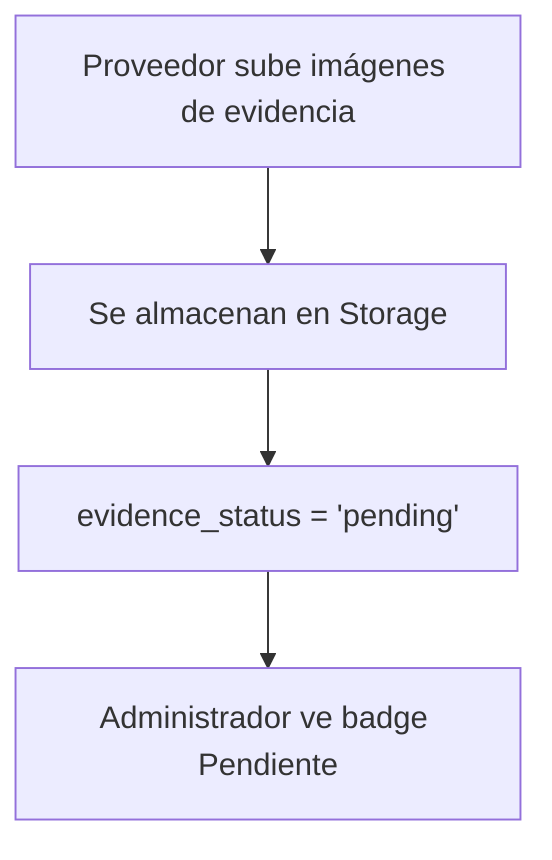
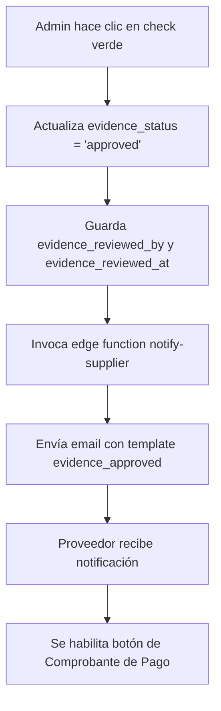
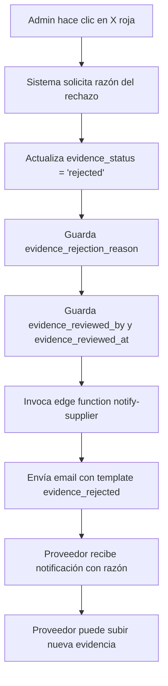

# Sistema de Validación de Evidencias de Entrega con Notificaciones por Email

## Descripción General

Sistema completo para la validación de evidencias de entrega de facturas, que incluye aprobación/rechazo por parte del administrador y notificaciones automáticas por correo electrónico al proveedor.

## Arquitectura del Sistema

### 1. Base de Datos - Campos Adicionales en la tabla `invoices`

```sql
-- Agregar campos para validación de evidencias de entrega
ALTER TABLE invoices 
ADD COLUMN evidence_status TEXT DEFAULT 'pending' CHECK (evidence_status IN ('pending', 'approved', 'rejected')),
ADD COLUMN evidence_reviewed_by UUID REFERENCES auth.users(id),
ADD COLUMN evidence_reviewed_at TIMESTAMP WITH TIME ZONE,
ADD COLUMN evidence_rejection_reason TEXT;

-- Agregar comentarios
COMMENT ON COLUMN invoices.evidence_status IS 'Estado de validación de las evidencias de entrega: pending, approved, rejected';
COMMENT ON COLUMN invoices.evidence_reviewed_by IS 'ID del administrador que revisó las evidencias';
COMMENT ON COLUMN invoices.evidence_reviewed_at IS 'Fecha y hora de la revisión de evidencias';
COMMENT ON COLUMN invoices.evidence_rejection_reason IS 'Razón del rechazo de las evidencias';
```

### 2. Frontend - Hook de Notificaciones

**Archivo: `src/hooks/useNotifications.tsx`**

Agregar los nuevos tipos de notificación:

```typescript
type NotificationType = 
  | 'account_approved' 
  | 'account_rejected' 
  | 'document_approved' 
  | 'document_rejected'
  | 'invoice_validated' 
  | 'invoice_rejected' 
  | 'payment_completed' 
  | 'payment_pending'
  | 'purchase_order_created' 
  | 'new_message'
  | 'evidence_approved'    // NUEVO
  | 'evidence_rejected';   // NUEVO
```

### 3. Frontend - Mutaciones para Aprobar/Rechazar Evidencias

**Archivo: `src/pages/Invoices.tsx`**

#### 3.1 Importar iconos necesarios

```typescript
import { Receipt, Upload, FileText, Download, DollarSign, Eye, Trash2, FileImage, Truck, Check, X } from "lucide-react";
```

#### 3.2 Mutación para Aprobar Evidencia

```typescript
const approveEvidenceMutation = useMutation({
  mutationFn: async (invoice: any) => {
    const { error } = await supabase
      .from("invoices")
      .update({
        evidence_status: 'approved',
        evidence_reviewed_by: user!.id,
        evidence_reviewed_at: new Date().toISOString()
      } as any)
      .eq("id", invoice.id);

    if (error) throw error;

    // Enviar notificación por email al proveedor
    await supabase.functions.invoke("notify-supplier", {
      body: {
        supplier_id: invoice.supplier_id,
        type: 'evidence_approved',
        data: {
          invoice_number: invoice.invoice_number,
          invoice_amount: invoice.amount
        }
      }
    });
  },
  onSuccess: () => {
    toast.success("Evidencia aprobada");
    queryClient.invalidateQueries({ queryKey: ["invoices"] });
  },
  onError: (error: any) => {
    toast.error(error.message || "Error al aprobar evidencia");
  },
});
```

#### 3.3 Mutación para Rechazar Evidencia

```typescript
const rejectEvidenceMutation = useMutation({
  mutationFn: async ({ invoice, reason }: { invoice: any; reason: string }) => {
    const { error } = await supabase
      .from("invoices")
      .update({
        evidence_status: 'rejected',
        evidence_reviewed_by: user!.id,
        evidence_reviewed_at: new Date().toISOString(),
        evidence_rejection_reason: reason
      } as any)
      .eq("id", invoice.id);

    if (error) throw error;

    // Enviar notificación por email al proveedor
    await supabase.functions.invoke("notify-supplier", {
      body: {
        supplier_id: invoice.supplier_id,
        type: 'evidence_rejected',
        data: {
          invoice_number: invoice.invoice_number,
          invoice_amount: invoice.amount,
          rejection_reason: reason
        }
      }
    });
  },
  onSuccess: () => {
    toast.success("Evidencia rechazada");
    queryClient.invalidateQueries({ queryKey: ["invoices"] });
  },
  onError: (error: any) => {
    toast.error(error.message || "Error al rechazar evidencia");
  },
});
```

#### 3.4 Función para obtener Badge de Estado

```typescript
const getEvidenceStatusBadge = (status: string) => {
  switch (status) {
    case "approved":
      return <Badge className="bg-success">Aprobada</Badge>;
    case "rejected":
      return <Badge variant="destructive">Rechazada</Badge>;
    default:
      return <Badge className="bg-warning">Pendiente</Badge>;
  }
};
```

#### 3.5 UI - Botones de Validación en el Listado

```tsx
{invoice.delivery_evidence_url && Array.isArray(invoice.delivery_evidence_url) && invoice.delivery_evidence_url.length > 0 && (
  <>
    <ImageViewer
      imageUrls={invoice.delivery_evidence_url}
      fileName={`Evidencia-${invoice.invoice_number}`}
      triggerText="Evidencia"
      triggerSize="icon"
      triggerVariant="outline"
      bucket="invoices"
    />
    
    {isAdmin && (
      <>
        <div className="flex items-center gap-1">
          {getEvidenceStatusBadge(invoice.evidence_status || 'pending')}
        </div>
        
        {invoice.evidence_status === 'pending' && (
          <>
            <TooltipProvider>
              <Tooltip>
                <TooltipTrigger asChild>
                  <Button
                    variant="outline"
                    size="icon"
                    className="h-8 w-8 text-success hover:bg-success/10"
                    onClick={() => approveEvidenceMutation.mutate(invoice)}
                  >
                    <Check className="h-3.5 w-3.5" />
                  </Button>
                </TooltipTrigger>
                <TooltipContent>
                  <p>Aprobar evidencia</p>
                </TooltipContent>
              </Tooltip>
            </TooltipProvider>

            <TooltipProvider>
              <Tooltip>
                <TooltipTrigger asChild>
                  <Button
                    variant="outline"
                    size="icon"
                    className="h-8 w-8 text-destructive hover:bg-destructive/10"
                    onClick={() => {
                      const reason = prompt("Razón del rechazo:");
                      if (reason) {
                        rejectEvidenceMutation.mutate({ invoice, reason });
                      }
                    }}
                  >
                    <X className="h-3.5 w-3.5" />
                  </Button>
                </TooltipTrigger>
                <TooltipContent>
                  <p>Rechazar evidencia</p>
                </TooltipContent>
              </Tooltip>
            </TooltipProvider>
          </>
        )}
      </>
    )}
  </>
)}
```

#### 3.6 Condicional para habilitar Comprobante de Pago

El botón de comprobante de pago solo se habilita si la evidencia está aprobada:

```tsx
{isAdmin && invoice.evidence_status === 'approved' && (
  <InvoicePaymentProofUpload
    invoiceId={invoice.id}
    supplierId={invoice.supplier_id}
    hasProof={!!invoice.comprobante_pago_url}
    proofUrl={invoice.comprobante_pago_url}
  />
)}
```

### 4. Backend - Templates de Email

**Archivo: `supabase/functions/notify-supplier/index.ts`**

#### 4.1 Template: Evidencia Aprobada

```typescript
evidence_approved: (data) => ({
  subject: `✅ Evidencia de Entrega Aprobada - Factura ${data.invoice_number}`,
  html: `
    <!DOCTYPE html>
    <html>
      <head>
        <meta charset="utf-8">
        <style>
          body { 
            font-family: Arial, sans-serif; 
            line-height: 1.6; 
            color: #333; 
            margin: 0;
            padding: 0;
            background-color: #f5f5f5;
          }
          .container { 
            max-width: 600px; 
            margin: 0 auto; 
            background: white;
          }
          .header { 
            background-color: #22c55e; 
            color: white; 
            padding: 20px 30px; 
            text-align: center; 
          }
          .header h1 {
            margin: 0;
            font-size: 24px;
            font-weight: normal;
          }
          .success-notice {
            background-color: #d1fae5;
            border: 1px solid #a7f3d0;
            padding: 20px;
            margin: 20px 30px;
            text-align: center;
            border-radius: 4px;
          }
          .success-notice h2 {
            color: #059669;
            margin: 0 0 10px 0;
            font-size: 20px;
          }
          .content { 
            padding: 0 30px 30px 30px;
          }
          .info-box {
            background: #f9fafb;
            border-left: 3px solid #22c55e;
            padding: 15px;
            margin: 15px 0;
          }
          .info-box p {
            margin: 5px 0;
          }
          .next-steps {
            background: #dbeafe;
            border-left: 3px solid #3b82f6;
            padding: 15px;
            margin: 20px 0;
          }
          .next-steps strong {
            color: #1e40af;
          }
          .footer { 
            text-align: center; 
            padding: 20px 30px;
            background-color: #f9fafb;
            color: #6b7280; 
            font-size: 14px;
            border-top: 1px solid #e5e7eb;
          }
          .footer p {
            margin: 5px 0;
          }
        </style>
      </head>
      <body>
        <div class="container">
          <div class="header">
            <h1>✓ Evidencia de Entrega Aprobada</h1>
          </div>
          
          <div class="success-notice">
            <h2>¡La evidencia ha sido validada!</h2>
            <p>Tu evidencia de entrega fue revisada y aprobada por el equipo administrativo</p>
          </div>

          <div class="content">
            <p><strong>Estimado proveedor,</strong></p>
            
            <p>Nos complace informarte que la evidencia de entrega que proporcionaste ha sido aprobada exitosamente.</p>

            <div class="info-box">
              <p><strong>📄 Factura:</strong> ${data.invoice_number}</p>
              <p><strong>💰 Monto:</strong> $${parseFloat(data.invoice_amount).toLocaleString('es-MX', { minimumFractionDigits: 2 })} MXN</p>
              <p><strong>✅ Estado:</strong> Evidencia Aprobada</p>
            </div>

            <div class="next-steps">
              <p><strong>🎯 Siguiente paso:</strong></p>
              <p>Ahora que tu evidencia ha sido aprobada, el administrador procederá a subir el comprobante de pago correspondiente.</p>
            </div>

            <p>Puedes dar seguimiento al estado de tu pago en el portal:</p>
            <p style="text-align: center; margin-top: 20px;">
              <a href="https://qualmedical.iakan.es" style="display: inline-block; padding: 12px 30px; background: #22c55e; color: white; text-decoration: none; border-radius: 5px; font-weight: bold;">
                Acceder al Portal
              </a>
            </p>
          </div>

          <div class="footer">
            <p>Este es un mensaje automático del Sistema QualMedical</p>
            <p>© 2025 QualMedical. Todos los derechos reservados.</p>
          </div>
        </div>
      </body>
    </html>
  `
}),
```

#### 4.2 Template: Evidencia Rechazada

```typescript
evidence_rejected: (data) => ({
  subject: `❌ Evidencia de Entrega Rechazada - Factura ${data.invoice_number}`,
  html: `
    <!DOCTYPE html>
    <html>
      <head>
        <meta charset="utf-8">
        <style>
          body { 
            font-family: Arial, sans-serif; 
            line-height: 1.6; 
            color: #333; 
            margin: 0;
            padding: 0;
            background-color: #f5f5f5;
          }
          .container { 
            max-width: 600px; 
            margin: 0 auto; 
            background: white;
          }
          .header { 
            background-color: #ef4444; 
            color: white; 
            padding: 20px 30px; 
            text-align: center; 
          }
          .header h1 {
            margin: 0;
            font-size: 24px;
            font-weight: normal;
          }
          .alert-box {
            background-color: #fee2e2;
            border: 1px solid #fecaca;
            padding: 20px;
            margin: 20px 30px;
            text-align: center;
            border-radius: 4px;
          }
          .alert-box h2 {
            color: #dc2626;
            margin: 0 0 10px 0;
            font-size: 20px;
          }
          .content { 
            padding: 0 30px 30px 30px;
          }
          .info-box {
            background: #f9fafb;
            border-left: 3px solid #ef4444;
            padding: 15px;
            margin: 15px 0;
          }
          .info-box p {
            margin: 5px 0;
          }
          .reason-box {
            background: #fef3c7;
            border-left: 3px solid #f59e0b;
            padding: 15px;
            margin: 20px 0;
          }
          .reason-box strong {
            color: #d97706;
          }
          .action-box {
            background: #dbeafe;
            border-left: 3px solid #3b82f6;
            padding: 15px;
            margin: 20px 0;
          }
          .action-box strong {
            color: #1e40af;
          }
          .footer { 
            text-align: center; 
            padding: 20px 30px;
            background-color: #f9fafb;
            color: #6b7280; 
            font-size: 14px;
            border-top: 1px solid #e5e7eb;
          }
          .footer p {
            margin: 5px 0;
          }
        </style>
      </head>
      <body>
        <div class="container">
          <div class="header">
            <h1>⚠️ Evidencia de Entrega Rechazada</h1>
          </div>
          
          <div class="alert-box">
            <h2>La evidencia requiere correcciones</h2>
            <p>Tu evidencia de entrega ha sido revisada y necesita ser corregida</p>
          </div>

          <div class="content">
            <p><strong>Estimado proveedor,</strong></p>
            
            <p>Hemos revisado la evidencia de entrega que proporcionaste y lamentablemente no cumple con los requisitos necesarios.</p>

            <div class="info-box">
              <p><strong>📄 Factura:</strong> ${data.invoice_number}</p>
              <p><strong>💰 Monto:</strong> $${parseFloat(data.invoice_amount).toLocaleString('es-MX', { minimumFractionDigits: 2 })} MXN</p>
              <p><strong>❌ Estado:</strong> Evidencia Rechazada</p>
            </div>

            ${data.rejection_reason ? `
            <div class="reason-box">
              <p><strong>📝 Razón del rechazo:</strong></p>
              <p style="margin: 10px 0 0 0;">${data.rejection_reason}</p>
            </div>
            ` : ''}

            <div class="action-box">
              <p><strong>🔧 Acción requerida:</strong></p>
              <p>Por favor, revisa la razón del rechazo y vuelve a subir la evidencia de entrega con las correcciones necesarias.</p>
              <p style="margin-top: 10px;"><strong>Nota:</strong> Asegúrate de que las imágenes sean claras, legibles y muestren la entrega completa del pedido.</p>
            </div>

            <p style="text-align: center; margin-top: 20px;">
              <a href="https://qualmedical.iakan.es" style="display: inline-block; padding: 12px 30px; background: #ef4444; color: white; text-decoration: none; border-radius: 5px; font-weight: bold;">
                Subir Nueva Evidencia
              </a>
            </p>
          </div>

          <div class="footer">
            <p>Este es un mensaje automático del Sistema QualMedical</p>
            <p>© 2025 QualMedical. Todos los derechos reservados.</p>
          </div>
        </div>
      </body>
    </html>
  `
})
```

## Flujo Completo del Sistema

### 1. Proveedor Sube Evidencia de Entrega



### 2. Administrador Aprueba Evidencia



### 3. Administrador Rechaza Evidencia



## Configuración Necesaria

### Variables de Entorno (SMTP)

Las siguientes variables deben estar configuradas en Supabase Secrets:

```
SMTP_HOST=smtp.ejemplo.com
SMTP_PORT=587
SMTP_USER=usuario@ejemplo.com
SMTP_PASSWORD=contraseña_smtp
SMTP_FROM_EMAIL=noreply@qualmedical.com
```

### Permisos RLS (Row Level Security)

Asegurar que los campos agregados estén cubiertos por las políticas RLS existentes en la tabla `invoices`:

- Proveedores: pueden ver solo sus propias facturas (incluyendo `evidence_status`)
- Administradores: pueden actualizar todos los campos de evidencias
- Proveedores: pueden actualizar `delivery_evidence_url` pero no los campos de validación

## Estados de Evidencia

| Estado | Descripción | Badge Color | Acción Siguiente |
|--------|-------------|-------------|------------------|
| `pending` | Evidencia pendiente de revisión | Amarillo | Admin debe revisar |
| `approved` | Evidencia aprobada | Verde | Admin puede subir comprobante de pago |
| `rejected` | Evidencia rechazada | Rojo | Proveedor debe subir nueva evidencia |

## Mejoras Futuras Sugeridas

1. **Historial de Validaciones**: Crear tabla `evidence_reviews` para registrar todas las revisiones
2. **Comentarios**: Permitir comentarios del administrador sin rechazar completamente
3. **Notificaciones In-App**: Agregar notificaciones dentro del sistema además del email
4. **Dashboard de Evidencias**: Vista específica para gestión de evidencias pendientes
5. **Recordatorios Automáticos**: Enviar recordatorios si una evidencia lleva mucho tiempo pendiente

## Ejemplo de Integración

Para integrar este sistema en otro proyecto:

1. **Crear la migración SQL** para agregar los campos a la tabla de facturas
2. **Copiar los templates de email** en la función de notificaciones
3. **Implementar las mutaciones** en el frontend
4. **Agregar los componentes UI** (botones, badges, tooltips)
5. **Configurar SMTP** para envío de emails
6. **Ajustar los enlaces** del portal según tu dominio

---

**Versión**: 1.0  
**Fecha**: Noviembre 2025  
**Sistema**: QualMedical - Gestión de Proveedores
