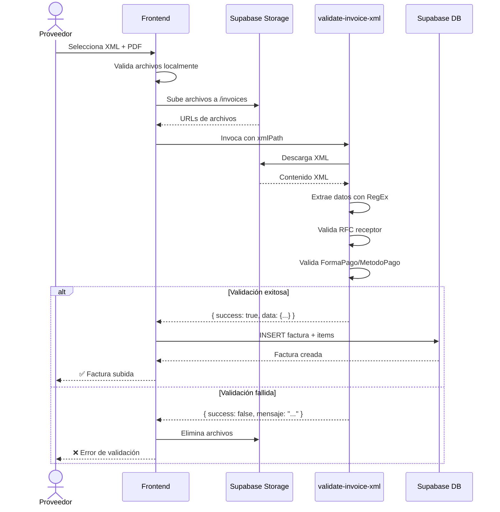
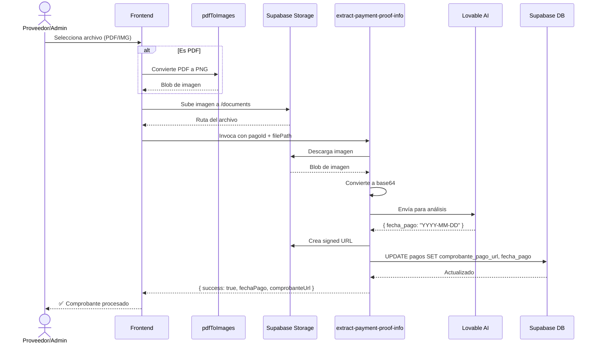
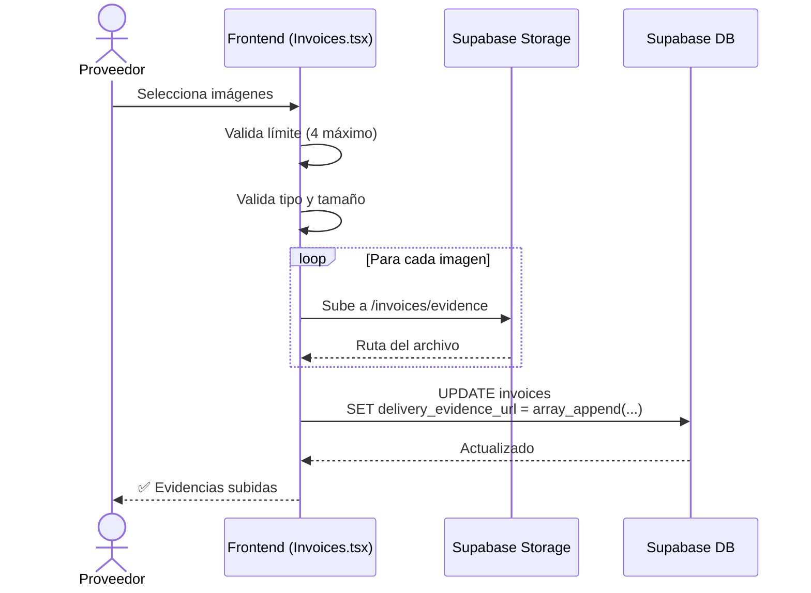

# Sistema de Validación de Facturas, Comprobantes de Pago y Evidencias

## Índice
1. [Arquitectura General](#arquitectura-general)
2. [Base de Datos](#base-de-datos)
3. [Edge Functions](#edge-functions)
4. [Componentes Frontend](#componentes-frontend)
5. [Utilidades y Hooks](#utilidades-y-hooks)
6. [Flujos de Trabajo](#flujos-de-trabajo)
7. [Configuración Requerida](#configuración-requerida)

---

## Arquitectura General

Este sistema implementa 3 funcionalidades principales:
1. **Validación de XML de Facturas**: Valida archivos XML contra reglas de negocio específicas (RFC del receptor, forma de pago, método de pago)
2. **Gestión de Comprobantes de Pago**: Permite subir imágenes/PDFs de comprobantes y extrae información usando IA
3. **Subida y Validación de Evidencias**: Gestiona evidencias de entrega (hasta 4 imágenes) y complementos de pago

**Stack Tecnológico:**
- Frontend: React + TypeScript + TanStack Query
- Backend: Supabase Edge Functions (Deno)
- Storage: Supabase Storage (buckets privados)
- IA: Lovable AI API (para extracción de datos de imágenes)
- Conversión: pdfjs-dist (PDF a imágenes)

---

## Base de Datos

### Tablas Necesarias

#### 1. `invoices` (Facturas)
```sql
CREATE TABLE public.invoices (
  id UUID PRIMARY KEY DEFAULT gen_random_uuid(),
  supplier_id UUID NOT NULL REFERENCES auth.users(id),
  invoice_number TEXT NOT NULL,
  amount NUMERIC NOT NULL,
  subtotal NUMERIC,
  descuento NUMERIC DEFAULT 0,
  total_impuestos NUMERIC DEFAULT 0,
  currency TEXT DEFAULT 'MXN',
  status TEXT DEFAULT 'pendiente',
  
  -- Archivos principales
  pdf_url TEXT NOT NULL,
  xml_url TEXT NOT NULL,
  
  -- Datos extraídos del XML
  uuid TEXT,
  emisor_nombre TEXT,
  emisor_rfc TEXT,
  emisor_regimen_fiscal TEXT,
  receptor_nombre TEXT,
  receptor_rfc TEXT,
  receptor_uso_cfdi TEXT,
  forma_pago TEXT,
  metodo_pago TEXT,
  lugar_expedicion TEXT,
  fecha_emision TIMESTAMPTZ,
  
  -- Complementos y evidencias
  complemento_pago_url TEXT,
  delivery_evidence_url TEXT[] DEFAULT ARRAY[]::TEXT[],
  requiere_complemento BOOLEAN DEFAULT false,
  
  notes TEXT,
  payment_date DATE,
  created_at TIMESTAMPTZ DEFAULT NOW(),
  updated_at TIMESTAMPTZ DEFAULT NOW()
);

-- RLS Policies
ALTER TABLE public.invoices ENABLE ROW LEVEL SECURITY;

CREATE POLICY "Los proveedores pueden ver sus propias facturas"
ON public.invoices FOR SELECT
USING (auth.uid() = supplier_id);

CREATE POLICY "Los proveedores pueden insertar sus propias facturas"
ON public.invoices FOR INSERT
WITH CHECK (auth.uid() = supplier_id);

CREATE POLICY "Los proveedores pueden actualizar evidencia de entrega"
ON public.invoices FOR UPDATE
USING (auth.uid() = supplier_id)
WITH CHECK (auth.uid() = supplier_id);

CREATE POLICY "Los admins pueden ver todas las facturas"
ON public.invoices FOR SELECT
USING (public.is_admin(auth.uid()));

CREATE POLICY "Los admins pueden actualizar todas las facturas"
ON public.invoices FOR UPDATE
USING (public.is_admin(auth.uid()));

CREATE POLICY "Los admins pueden eliminar facturas"
ON public.invoices FOR DELETE
USING (public.is_admin(auth.uid()));
```

#### 2. `invoice_items` (Conceptos de facturas)
```sql
CREATE TABLE public.invoice_items (
  id UUID PRIMARY KEY DEFAULT gen_random_uuid(),
  invoice_id UUID NOT NULL REFERENCES public.invoices(id) ON DELETE CASCADE,
  descripcion TEXT NOT NULL,
  cantidad NUMERIC NOT NULL,
  unidad TEXT,
  valor_unitario NUMERIC NOT NULL,
  importe NUMERIC NOT NULL,
  descuento NUMERIC DEFAULT 0,
  clave_prod_serv TEXT,
  clave_unidad TEXT,
  created_at TIMESTAMPTZ DEFAULT NOW()
);

-- RLS Policies
ALTER TABLE public.invoice_items ENABLE ROW LEVEL SECURITY;

CREATE POLICY "Los proveedores pueden ver items de sus propias facturas"
ON public.invoice_items FOR SELECT
USING (
  EXISTS (
    SELECT 1 FROM public.invoices
    WHERE invoices.id = invoice_items.invoice_id
    AND invoices.supplier_id = auth.uid()
  )
);

CREATE POLICY "Los admins pueden ver todos los items de facturas"
ON public.invoice_items FOR SELECT
USING (public.is_admin(auth.uid()));

CREATE POLICY "Solo admins pueden insertar items de facturas"
ON public.invoice_items FOR INSERT
WITH CHECK (public.is_admin(auth.uid()));

CREATE POLICY "Nadie puede actualizar items de facturas"
ON public.invoice_items FOR UPDATE
USING (false);

CREATE POLICY "Los admins pueden eliminar items de facturas"
ON public.invoice_items FOR DELETE
USING (public.is_admin(auth.uid()));
```

#### 3. `pagos` (Pagos y comprobantes)
```sql
CREATE TABLE public.pagos (
  id UUID PRIMARY KEY DEFAULT gen_random_uuid(),
  supplier_id UUID NOT NULL REFERENCES auth.users(id),
  invoice_id UUID NOT NULL REFERENCES public.invoices(id),
  datos_bancarios_id UUID NOT NULL REFERENCES public.documents(id),
  amount NUMERIC NOT NULL,
  status TEXT NOT NULL DEFAULT 'pendiente',
  
  -- Comprobante de pago
  comprobante_pago_url TEXT,
  fecha_pago DATE,
  nombre_banco TEXT,
  
  created_by UUID,
  created_at TIMESTAMPTZ DEFAULT NOW(),
  updated_at TIMESTAMPTZ DEFAULT NOW()
);

-- RLS Policies
ALTER TABLE public.pagos ENABLE ROW LEVEL SECURITY;

CREATE POLICY "Los proveedores pueden ver sus propios pagos"
ON public.pagos FOR SELECT
USING (auth.uid() = supplier_id);

CREATE POLICY "Los admins pueden ver todos los pagos"
ON public.pagos FOR SELECT
USING (public.is_admin(auth.uid()));

CREATE POLICY "Los admins pueden insertar pagos"
ON public.pagos FOR INSERT
WITH CHECK (public.is_admin(auth.uid()));

CREATE POLICY "Los admins pueden actualizar pagos"
ON public.pagos FOR UPDATE
USING (public.is_admin(auth.uid()));

CREATE POLICY "Los admins pueden eliminar pagos"
ON public.pagos FOR DELETE
USING (public.is_admin(auth.uid()));
```

### Storage Buckets

```sql
-- Bucket para facturas (PDF y XML)
INSERT INTO storage.buckets (id, name, public)
VALUES ('invoices', 'invoices', false);

-- Políticas del bucket de facturas
CREATE POLICY "Los proveedores pueden subir sus propias facturas"
ON storage.objects FOR INSERT
WITH CHECK (
  bucket_id = 'invoices' 
  AND auth.uid()::text = (storage.foldername(name))[1]
);

CREATE POLICY "Los proveedores pueden ver sus propias facturas"
ON storage.objects FOR SELECT
USING (
  bucket_id = 'invoices' 
  AND auth.uid()::text = (storage.foldername(name))[1]
);

CREATE POLICY "Los admins pueden ver todas las facturas"
ON storage.objects FOR SELECT
USING (
  bucket_id = 'invoices' 
  AND public.is_admin(auth.uid())
);

-- Bucket para documentos (comprobantes de pago)
INSERT INTO storage.buckets (id, name, public)
VALUES ('documents', 'documents', false);

-- Políticas del bucket de documentos
CREATE POLICY "Los proveedores pueden subir sus propios documentos"
ON storage.objects FOR INSERT
WITH CHECK (
  bucket_id = 'documents' 
  AND auth.uid()::text = (storage.foldername(name))[1]
);

CREATE POLICY "Los proveedores pueden ver sus propios documentos"
ON storage.objects FOR SELECT
USING (
  bucket_id = 'documents' 
  AND auth.uid()::text = (storage.foldername(name))[1]
);

CREATE POLICY "Los admins pueden ver todos los documentos"
ON storage.objects FOR SELECT
USING (
  bucket_id = 'documents' 
  AND public.is_admin(auth.uid())
);
```

### Función Helper: `is_admin`

Esta función debe existir para las políticas RLS:

```sql
CREATE OR REPLACE FUNCTION public.is_admin(_user_id UUID)
RETURNS BOOLEAN
LANGUAGE SQL
STABLE SECURITY DEFINER
SET search_path = public
AS $$
  SELECT EXISTS (
    SELECT 1
    FROM public.user_roles
    WHERE user_id = _user_id 
    AND role = 'admin'
  )
$$;
```

---

## Edge Functions

### 1. `validate-invoice-xml` - Validación de XML

**Archivo:** `supabase/functions/validate-invoice-xml/index.ts`

**Descripción:** Descarga el XML de Storage, extrae información usando RegEx, y valida reglas de negocio críticas.

**Validaciones:**
1. RFC del receptor debe ser exactamente `QME240321HF3`
2. Si `FormaPago = 99`, entonces `MetodoPago` debe ser `PPD`

**Código completo:**

```typescript
import { serve } from "https://deno.land/std@0.168.0/http/server.ts";
import { createClient } from 'https://esm.sh/@supabase/supabase-js@2';

const corsHeaders = {
  'Access-Control-Allow-Origin': '*',
  'Access-Control-Allow-Headers': 'authorization, x-client-info, apikey, content-type',
};

// RFC de QualMedical
const RFC_QUALMEDICAL = 'QME240321HF3';

serve(async (req) => {
  // Handle CORS preflight requests
  if (req.method === 'OPTIONS') {
    return new Response(null, { headers: corsHeaders });
  }

  try {
    const { xmlPath } = await req.json();

    if (!xmlPath) {
      throw new Error('xmlPath es requerido');
    }

    // Inicializar cliente de Supabase con service role
    const supabaseAdmin = createClient(
      Deno.env.get('SUPABASE_URL') ?? '',
      Deno.env.get('SUPABASE_SERVICE_ROLE_KEY') ?? ''
    );

    console.log('Descargando XML desde storage:', xmlPath);

    // Descargar el archivo XML desde Storage
    const { data: fileData, error: downloadError } = await supabaseAdmin
      .storage
      .from('invoices')
      .download(xmlPath);

    if (downloadError || !fileData) {
      console.error('Error al descargar XML:', downloadError);
      throw new Error('No se pudo descargar el archivo XML');
    }

    const xmlText = await fileData.text();
    console.log('XML descargado exitosamente, tamaño:', xmlText.length);

    // Extraer información del XML usando RegEx
    const formaPagoMatch = xmlText.match(/FormaPago="([^"]+)"/);
    const metodoPagoMatch = xmlText.match(/MetodoPago="([^"]+)"/);
    const folioMatch = xmlText.match(/Folio="([^"]+)"/);
    const totalMatch = xmlText.match(/Total="([^"]+)"/);
    const uuidMatch = xmlText.match(/UUID="([^"]+)"/);
    const emisorMatch = xmlText.match(/<cfdi:Emisor[^>]*Nombre="([^"]+)"/);
    const emisorRfcMatch = xmlText.match(/<cfdi:Emisor[^>]*Rfc="([^"]+)"/);
    const emisorRegimenMatch = xmlText.match(/RegimenFiscal="([^"]+)"/);
    const receptorMatch = xmlText.match(/<cfdi:Receptor[^>]*Nombre="([^"]+)"/);
    const receptorRfcMatch = xmlText.match(/<cfdi:Receptor[^>]*Rfc="([^"]+)"/);
    const receptorUsoCfdiMatch = xmlText.match(/<cfdi:Receptor[^>]*UsoCFDI="([^"]+)"/);
    const lugarExpedicionMatch = xmlText.match(/LugarExpedicion="([^"]+)"/);
    const fechaMatch = xmlText.match(/Fecha="([^"]+)"/);
    const subtotalMatch = xmlText.match(/SubTotal="([^"]+)"/);
    const descuentoMatch = xmlText.match(/Descuento="([^"]+)"/);

    // Extraer conceptos
    const conceptoMatches = xmlText.matchAll(/<cfdi:Concepto[^>]*>/g);
    const conceptos = [];
    
    for (const match of conceptoMatches) {
      const conceptoStr = match[0];
      const descripcionMatch = conceptoStr.match(/Descripcion="([^"]+)"/);
      const cantidadMatch = conceptoStr.match(/Cantidad="([^"]+)"/);
      const valorUnitarioMatch = conceptoStr.match(/ValorUnitario="([^"]+)"/);
      const importeMatch = conceptoStr.match(/Importe="([^"]+)"/);
      const unidadMatch = conceptoStr.match(/Unidad="([^"]+)"/);
      const claveProdServMatch = conceptoStr.match(/ClaveProdServ="([^"]+)"/);
      const claveUnidadMatch = conceptoStr.match(/ClaveUnidad="([^"]+)"/);
      const descuentoConceptoMatch = conceptoStr.match(/Descuento="([^"]+)"/);

      conceptos.push({
        descripcion: descripcionMatch ? descripcionMatch[1] : '',
        cantidad: cantidadMatch ? parseFloat(cantidadMatch[1]) : 0,
        valorUnitario: valorUnitarioMatch ? parseFloat(valorUnitarioMatch[1]) : 0,
        importe: importeMatch ? parseFloat(importeMatch[1]) : 0,
        unidad: unidadMatch ? unidadMatch[1] : null,
        claveProdServ: claveProdServMatch ? claveProdServMatch[1] : null,
        claveUnidad: claveUnidadMatch ? claveUnidadMatch[1] : null,
        descuento: descuentoConceptoMatch ? parseFloat(descuentoConceptoMatch[1]) : 0
      });
    }

    // Extraer impuestos
    const impuestosTrasladadosMatch = xmlText.match(/TotalImpuestosTrasladados="([^"]+)"/);
    const totalImpuestos = impuestosTrasladadosMatch ? parseFloat(impuestosTrasladadosMatch[1]) : 0;

    const formaPago = formaPagoMatch ? formaPagoMatch[1] : null;
    const metodoPago = metodoPagoMatch ? metodoPagoMatch[1] : null;
    const folio = folioMatch ? folioMatch[1] : null;
    const total = totalMatch ? parseFloat(totalMatch[1]) : 0;
    const uuid = uuidMatch ? uuidMatch[1] : null;
    const emisorNombre = emisorMatch ? emisorMatch[1] : null;
    const emisorRfc = emisorRfcMatch ? emisorRfcMatch[1] : null;
    const emisorRegimen = emisorRegimenMatch ? emisorRegimenMatch[1] : null;
    const receptorNombre = receptorMatch ? receptorMatch[1] : null;
    const receptorRfc = receptorRfcMatch ? receptorRfcMatch[1] : null;
    const receptorUsoCfdi = receptorUsoCfdiMatch ? receptorUsoCfdiMatch[1] : null;
    const lugarExpedicion = lugarExpedicionMatch ? lugarExpedicionMatch[1] : null;
    const fechaEmision = fechaMatch ? fechaMatch[1] : null;
    const subtotal = subtotalMatch ? parseFloat(subtotalMatch[1]) : 0;
    const descuento = descuentoMatch ? parseFloat(descuentoMatch[1]) : 0;

    console.log('Información extraída del XML:');
    console.log('- Número de factura:', folio);
    console.log('- Total:', total);
    console.log('- Emisor:', emisorNombre);
    console.log('- UUID:', uuid);
    console.log('- Conceptos encontrados:', conceptos.length);

    // VALIDACIÓN CRÍTICA 1: Verificar RFC del receptor
    if (receptorRfc !== RFC_QUALMEDICAL) {
      console.log('ERROR: RFC del receptor no corresponde a QualMedical');
      console.log('RFC encontrado:', receptorRfc, '| RFC esperado:', RFC_QUALMEDICAL);
      
      return new Response(
        JSON.stringify({
          success: false,
          error: 'RFC_INVALIDO',
          mensaje: `El RFC del receptor en la factura (${receptorRfc || 'no especificado'}) no corresponde a QualMedical (${RFC_QUALMEDICAL}). Por favor verifica que la factura esté emitida correctamente.`
        }),
        { 
          status: 200,
          headers: { 
            ...corsHeaders, 
            'Content-Type': 'application/json' 
          }
        }
      );
    }

    // VALIDACIÓN CRÍTICA 2: Si FormaPago = 99, entonces MetodoPago DEBE ser PPD
    if (formaPago === '99' && metodoPago !== 'PPD') {
      console.log('ERROR: FormaPago=99 pero MetodoPago no es PPD');
      
      return new Response(
        JSON.stringify({
          success: false,
          error: 'FORMA_PAGO_INVALIDA',
          mensaje: 'Error en el XML: Cuando la Forma de Pago es 99, el Método de Pago debe ser PPD. Se detectó Método de Pago: ' + (metodoPago || 'no especificado') + '.'
        }),
        { 
          status: 200,
          headers: { 
            ...corsHeaders, 
            'Content-Type': 'application/json' 
          }
        }
      );
    }

    // Determinar si requiere complemento de pago
    const requiereComplemento = formaPago === '99' || metodoPago === 'PPD';
    console.log('¿Requiere complemento de pago?:', requiereComplemento);

    return new Response(
      JSON.stringify({
        success: true,
        data: {
          formaPago,
          metodoPago,
          invoiceNumber: folio,
          amount: total,
          subtotal,
          descuento,
          totalImpuestos,
          uuid,
          emisorNombre,
          emisorRfc,
          emisorRegimenFiscal: emisorRegimen,
          receptorNombre,
          receptorRfc,
          receptorUsoCfdi,
          lugarExpedicion,
          fechaEmision,
          requiereComplemento,
          conceptos
        }
      }),
      { 
        headers: { 
          ...corsHeaders, 
          'Content-Type': 'application/json' 
        } 
      }
    );
  } catch (error) {
    console.error('Error en validate-invoice-xml:', error);
    return new Response(
      JSON.stringify({ 
        success: false,
        error: error.message || 'Error desconocido',
        mensaje: 'Error al procesar el XML: ' + (error.message || 'Error desconocido')
      }),
      { 
        status: 500,
        headers: { 
          ...corsHeaders, 
          'Content-Type': 'application/json' 
        }
      }
    );
  }
});
```

### 2. `extract-payment-proof-info` - Extracción de datos de comprobantes

**Archivo:** `supabase/functions/extract-payment-proof-info/index.ts`

**Descripción:** Descarga una imagen de comprobante de pago de Storage, usa Lovable AI para extraer la fecha de pago, y actualiza el registro en la base de datos.

**IA utilizada:** Lovable AI API (google/gemini-2.0-flash-lite)

**Código completo:**

```typescript
import { serve } from "https://deno.land/std@0.168.0/http/server.ts";
import { createClient } from 'https://esm.sh/@supabase/supabase-js@2';

const corsHeaders = {
  'Access-Control-Allow-Origin': '*',
  'Access-Control-Allow-Headers': 'authorization, x-client-info, apikey, content-type',
};

serve(async (req) => {
  if (req.method === 'OPTIONS') {
    return new Response(null, { headers: corsHeaders });
  }

  try {
    const { pagoId, filePath } = await req.json();

    if (!pagoId || !filePath) {
      throw new Error('pagoId y filePath son requeridos');
    }

    console.log('Procesando comprobante de pago:', { pagoId, filePath });

    // Inicializar cliente de Supabase Admin
    const supabaseAdmin = createClient(
      Deno.env.get('SUPABASE_URL') ?? '',
      Deno.env.get('SUPABASE_SERVICE_ROLE_KEY') ?? ''
    );

    // Descargar la imagen desde Storage
    const { data: fileData, error: downloadError } = await supabaseAdmin
      .storage
      .from('documents')
      .download(filePath);

    if (downloadError || !fileData) {
      console.error('Error al descargar imagen:', downloadError);
      throw new Error('No se pudo descargar el comprobante de pago');
    }

    console.log('Imagen descargada, procesando con IA...');

    // Convertir a base64
    const arrayBuffer = await fileData.arrayBuffer();
    const base64Image = btoa(
      new Uint8Array(arrayBuffer)
        .reduce((data, byte) => data + String.fromCharCode(byte), '')
    );
    const mimeType = fileData.type || 'image/jpeg';
    const dataUrl = `data:${mimeType};base64,${base64Image}`;

    // Llamar a Lovable AI para extraer la fecha de pago
    const lovableApiKey = Deno.env.get('LOVABLE_API_KEY');
    if (!lovableApiKey) {
      throw new Error('LOVABLE_API_KEY no configurada');
    }

    const aiResponse = await fetch('https://api.lovable.app/v1/ai/completions', {
      method: 'POST',
      headers: {
        'Authorization': `Bearer ${lovableApiKey}`,
        'Content-Type': 'application/json',
      },
      body: JSON.stringify({
        model: 'google/gemini-2.0-flash-lite',
        messages: [
          {
            role: 'user',
            content: [
              {
                type: 'text',
                text: 'Analiza esta imagen de un comprobante de pago bancario y extrae ÚNICAMENTE la fecha de pago. Responde en formato JSON: {"fecha_pago": "YYYY-MM-DD"}. Si no encuentras la fecha, responde: {"fecha_pago": null}'
              },
              {
                type: 'image_url',
                image_url: {
                  url: dataUrl
                }
              }
            ]
          }
        ],
        max_tokens: 150,
        temperature: 0.1
      })
    });

    if (!aiResponse.ok) {
      const errorText = await aiResponse.text();
      console.error('Error de Lovable AI:', errorText);
      throw new Error('Error al procesar imagen con IA');
    }

    const aiResult = await aiResponse.json();
    console.log('Respuesta de IA:', aiResult);

    // Extraer fecha de la respuesta
    let fechaPago = null;
    try {
      const content = aiResult.choices[0].message.content;
      const jsonMatch = content.match(/\{[^}]+\}/);
      if (jsonMatch) {
        const parsed = JSON.parse(jsonMatch[0]);
        fechaPago = parsed.fecha_pago;
      }
    } catch (e) {
      console.error('Error al parsear respuesta de IA:', e);
    }

    console.log('Fecha extraída:', fechaPago);

    // Obtener URL pública del comprobante
    const { data: urlData } = await supabaseAdmin
      .storage
      .from('documents')
      .createSignedUrl(filePath, 60 * 60 * 24 * 365); // 1 año

    // Actualizar el pago con el comprobante y la fecha
    const { error: updateError } = await supabaseAdmin
      .from('pagos')
      .update({
        comprobante_pago_url: urlData?.signedUrl || filePath,
        fecha_pago: fechaPago,
        updated_at: new Date().toISOString()
      })
      .eq('id', pagoId);

    if (updateError) {
      console.error('Error al actualizar pago:', updateError);
      throw new Error('No se pudo actualizar el registro de pago');
    }

    console.log('Pago actualizado exitosamente');

    return new Response(
      JSON.stringify({
        success: true,
        data: {
          fechaPago,
          comprobanteUrl: urlData?.signedUrl
        }
      }),
      {
        headers: {
          ...corsHeaders,
          'Content-Type': 'application/json'
        }
      }
    );

  } catch (error) {
    console.error('Error en extract-payment-proof-info:', error);
    return new Response(
      JSON.stringify({
        success: false,
        error: error.message || 'Error desconocido'
      }),
      {
        status: 500,
        headers: {
          ...corsHeaders,
          'Content-Type': 'application/json'
        }
      }
    );
  }
});
```

---

## Componentes Frontend

### 1. `InvoicePaymentProofUpload` - Subida de comprobantes de facturas

**Archivo:** `src/components/invoices/InvoicePaymentProofUpload.tsx`

**Descripción:** Componente para subir comprobantes de pago asociados a facturas. Maneja PDFs convirtiéndolos a imágenes, sube a Storage, y llama al edge function para extraer información.

**Código completo:**

```typescript
import { useState, useEffect } from "react";
import { Button } from "@/components/ui/button";
import { Dialog, DialogContent, DialogHeader, DialogTitle, DialogTrigger } from "@/components/ui/dialog";
import { Input } from "@/components/ui/input";
import { Label } from "@/components/ui/label";
import { Upload, FileText, Image as ImageIcon } from "lucide-react";
import { toast } from "sonner";
import { supabase } from "@/integrations/supabase/client";
import { useQueryClient, useMutation } from "@tanstack/react-query";
import { convertPDFToImages } from "@/lib/pdfToImages";
import { getSignedUrl } from "@/lib/storage";
import { Tooltip, TooltipContent, TooltipProvider, TooltipTrigger } from "@/components/ui/tooltip";

interface InvoicePaymentProofUploadProps {
  invoiceId: string;
  supplierId: string;
  hasProof: boolean;
  proofUrl?: string | null;
}

export function InvoicePaymentProofUpload({ 
  invoiceId, 
  supplierId,
  hasProof,
  proofUrl 
}: InvoicePaymentProofUploadProps) {
  const [open, setOpen] = useState(false);
  const [file, setFile] = useState<File | null>(null);
  const [signedUrl, setSignedUrl] = useState<string | null>(null);
  const [loadingImage, setLoadingImage] = useState(false);
  const queryClient = useQueryClient();

  // Cargar URL firmada del comprobante existente
  useEffect(() => {
    if (open && proofUrl && hasProof) {
      setLoadingImage(true);
      getSignedUrl('invoices', proofUrl)
        .then(url => {
          if (url) {
            setSignedUrl(url);
          }
        })
        .finally(() => setLoadingImage(false));
    } else {
      setSignedUrl(null);
    }
  }, [open, proofUrl, hasProof]);

  const uploadMutation = useMutation({
    mutationFn: async (uploadFile: File) => {
      // 1. Buscar el pago asociado a esta factura
      const { data: pagos, error: pagoError } = await supabase
        .from('pagos')
        .select('id')
        .eq('invoice_id', invoiceId)
        .maybeSingle();

      if (pagoError) throw pagoError;
      if (!pagos) throw new Error('No se encontró el pago asociado a esta factura');

      const pagoId = pagos.id;

      // 2. Convertir PDF a imagen si es necesario
      let finalFile = uploadFile;
      if (uploadFile.type === 'application/pdf') {
        toast.info('Convirtiendo PDF a imagen...');
        const result = await convertPDFToImages(uploadFile, 1);
        if (result.images.length === 0) {
          throw new Error('No se pudo convertir el PDF');
        }
        finalFile = new File([result.images[0]], 'comprobante.png', { type: 'image/png' });
      }

      // 3. Subir archivo a Storage
      const timestamp = Date.now();
      const fileExt = finalFile.name.split('.').pop();
      const filePath = `${supplierId}/payment-proofs/${timestamp}.${fileExt}`;

      const { error: uploadError } = await supabase.storage
        .from('invoices')
        .upload(filePath, finalFile);

      if (uploadError) throw uploadError;

      // 4. Invocar edge function para extraer información
      const { data, error: functionError } = await supabase.functions.invoke(
        'extract-payment-proof-info',
        {
          body: { pagoId, filePath }
        }
      );

      if (functionError) throw functionError;
      if (!data.success) throw new Error(data.error || 'Error al procesar comprobante');

      return data;
    },
    onSuccess: () => {
      toast.success('Comprobante de pago subido exitosamente');
      queryClient.invalidateQueries({ queryKey: ['invoices'] });
      queryClient.invalidateQueries({ queryKey: ['pagos'] });
      setOpen(false);
      setFile(null);
    },
    onError: (error: Error) => {
      console.error('Error al subir comprobante:', error);
      toast.error(error.message || 'Error al subir el comprobante de pago');
    }
  });

  const handleFileChange = (e: React.ChangeEvent<HTMLInputElement>) => {
    const selectedFile = e.target.files?.[0];
    if (!selectedFile) return;

    // Validar tipo de archivo
    const validTypes = ['image/jpeg', 'image/jpg', 'image/png', 'application/pdf'];
    if (!validTypes.includes(selectedFile.type)) {
      toast.error('Solo se permiten archivos JPG, PNG o PDF');
      return;
    }

    // Validar tamaño (máximo 10MB)
    if (selectedFile.size > 10 * 1024 * 1024) {
      toast.error('El archivo no debe superar los 10MB');
      return;
    }

    setFile(selectedFile);
  };

  const handleUpload = () => {
    if (!file) {
      toast.error('Por favor selecciona un archivo');
      return;
    }

    uploadMutation.mutate(file);
  };

  return (
    <Dialog open={open} onOpenChange={setOpen}>
      <TooltipProvider>
        <Tooltip>
          <TooltipTrigger asChild>
            <DialogTrigger asChild>
              <Button 
                variant={hasProof ? "outline" : "default"} 
                size="sm"
              >
                <Upload className="h-4 w-4 mr-2" />
                {hasProof ? 'Ver comprobante' : 'Subir comprobante'}
              </Button>
            </DialogTrigger>
          </TooltipTrigger>
          <TooltipContent>
            <p>{hasProof ? 'Ver o reemplazar comprobante de pago' : 'Subir comprobante de pago'}</p>
          </TooltipContent>
        </Tooltip>
      </TooltipProvider>

      <DialogContent className="max-w-2xl">
        <DialogHeader>
          <DialogTitle>
            {hasProof ? 'Comprobante de pago' : 'Subir comprobante de pago'}
          </DialogTitle>
        </DialogHeader>

        <div className="space-y-4">
          {hasProof && signedUrl && !loadingImage ? (
            <div className="space-y-4">
              <div className="border rounded-lg p-4">
                
              </div>
              <p className="text-sm text-muted-foreground">
                Para reemplazar el comprobante, sube uno nuevo abajo
              </p>
            </div>
          ) : loadingImage ? (
            <div className="text-center p-8">
              <p className="text-muted-foreground">Cargando comprobante...</p>
            </div>
          ) : null}

          <div className="space-y-2">
            <Label htmlFor="proof-file">
              {hasProof ? 'Reemplazar comprobante' : 'Seleccionar archivo'}
            </Label>
            <Input
              id="proof-file"
              type="file"
              accept="image/jpeg,image/jpg,image/png,application/pdf"
              onChange={handleFileChange}
              disabled={uploadMutation.isPending}
            />
            <p className="text-xs text-muted-foreground">
              Formatos: JPG, PNG o PDF. Máximo 10MB
            </p>
          </div>

          {file && (
            <div className="flex items-center gap-2 text-sm text-muted-foreground">
              {file.type === 'application/pdf' ? (
                <FileText className="h-4 w-4" />
              ) : (
                <ImageIcon className="h-4 w-4" />
              )}
              <span>{file.name}</span>
              <span className="text-xs">({(file.size / 1024).toFixed(0)} KB)</span>
            </div>
          )}

          <div className="flex justify-end gap-2">
            <Button
              variant="outline"
              onClick={() => setOpen(false)}
              disabled={uploadMutation.isPending}
            >
              Cancelar
            </Button>
            <Button
              onClick={handleUpload}
              disabled={!file || uploadMutation.isPending}
            >
              {uploadMutation.isPending ? 'Subiendo...' : 'Subir'}
            </Button>
          </div>
        </div>
      </DialogContent>
    </Dialog>
  );
}
```

### 2. `PaymentProofUpload` - Componente de subida de comprobantes para pagos

**Archivo:** `src/components/payments/PaymentProofUpload.tsx`

**Descripción:** Versión simplificada para la página de pagos. Similar a `InvoicePaymentProofUpload` pero con UI más compacta.

**Código completo:**

```typescript
import { useState } from "react";
import { Button } from "@/components/ui/button";
import { Dialog, DialogContent, DialogHeader, DialogTitle, DialogTrigger } from "@/components/ui/dialog";
import { Input } from "@/components/ui/input";
import { Label } from "@/components/ui/label";
import { Upload } from "lucide-react";
import { toast } from "sonner";
import { supabase } from "@/integrations/supabase/client";
import { useQueryClient, useMutation } from "@tanstack/react-query";
import { convertPDFToImages } from "@/lib/pdfToImages";

interface PaymentProofUploadProps {
  pagoId: string;
  supplierId: string;
}

export function PaymentProofUpload({ pagoId, supplierId }: PaymentProofUploadProps) {
  const [open, setOpen] = useState(false);
  const [file, setFile] = useState<File | null>(null);
  const queryClient = useQueryClient();

  const uploadMutation = useMutation({
    mutationFn: async (uploadFile: File) => {
      // Convertir PDF a imagen si es necesario
      let finalFile = uploadFile;
      if (uploadFile.type === 'application/pdf') {
        toast.info('Convirtiendo PDF a imagen...');
        const result = await convertPDFToImages(uploadFile, 1);
        if (result.images.length === 0) {
          throw new Error('No se pudo convertir el PDF');
        }
        finalFile = new File([result.images[0]], 'comprobante.png', { type: 'image/png' });
      }

      // Subir a Storage
      const timestamp = Date.now();
      const fileExt = finalFile.name.split('.').pop();
      const filePath = `${supplierId}/payment-proofs/${timestamp}.${fileExt}`;

      const { error: uploadError } = await supabase.storage
        .from('documents')
        .upload(filePath, finalFile);

      if (uploadError) throw uploadError;

      // Invocar edge function
      const { data, error: functionError } = await supabase.functions.invoke(
        'extract-payment-proof-info',
        {
          body: { pagoId, filePath }
        }
      );

      if (functionError) throw functionError;
      if (!data.success) throw new Error(data.error || 'Error al procesar comprobante');

      return data;
    },
    onSuccess: () => {
      toast.success('Comprobante subido exitosamente');
      queryClient.invalidateQueries({ queryKey: ['pagos'] });
      setOpen(false);
      setFile(null);
    },
    onError: (error: Error) => {
      toast.error(error.message || 'Error al subir el comprobante');
    }
  });

  const handleFileChange = (e: React.ChangeEvent<HTMLInputElement>) => {
    const selectedFile = e.target.files?.[0];
    if (!selectedFile) return;

    const validTypes = ['image/jpeg', 'image/jpg', 'image/png', 'application/pdf'];
    if (!validTypes.includes(selectedFile.type)) {
      toast.error('Solo se permiten archivos JPG, PNG o PDF');
      return;
    }

    if (selectedFile.size > 10 * 1024 * 1024) {
      toast.error('El archivo no debe superar los 10MB');
      return;
    }

    setFile(selectedFile);
  };

  return (
    <Dialog open={open} onOpenChange={setOpen}>
      <DialogTrigger asChild>
        <Button variant="outline" size="sm">
          <Upload className="h-4 w-4 mr-2" />
          Subir comprobante
        </Button>
      </DialogTrigger>

      <DialogContent>
        <DialogHeader>
          <DialogTitle>Subir comprobante de pago</DialogTitle>
        </DialogHeader>

        <div className="space-y-4">
          <div className="space-y-2">
            <Label htmlFor="payment-proof">Seleccionar archivo</Label>
            <Input
              id="payment-proof"
              type="file"
              accept="image/jpeg,image/jpg,image/png,application/pdf"
              onChange={handleFileChange}
              disabled={uploadMutation.isPending}
            />
            <p className="text-xs text-muted-foreground">
              JPG, PNG o PDF. Máximo 10MB
            </p>
          </div>

          <div className="flex justify-end gap-2">
            <Button
              variant="outline"
              onClick={() => setOpen(false)}
              disabled={uploadMutation.isPending}
            >
              Cancelar
            </Button>
            <Button
              onClick={() => file && uploadMutation.mutate(file)}
              disabled={!file || uploadMutation.isPending}
            >
              {uploadMutation.isPending ? 'Subiendo...' : 'Subir'}
            </Button>
          </div>
        </div>
      </DialogContent>
    </Dialog>
  );
}
```

### 3. `ImageViewer` - Visor de imágenes

**Archivo:** `src/components/admin/ImageViewer.tsx`

**Descripción:** Componente reutilizable para mostrar imágenes en un diálogo. Soporta URLs firmadas y carga lazy.

**Código completo:**

```typescript
import { Dialog, DialogContent, DialogHeader, DialogTitle } from "@/components/ui/dialog";
import { useState, useEffect } from "react";
import { getSignedUrl } from "@/lib/storage";

interface ImageViewerProps {
  open: boolean;
  onOpenChange: (open: boolean) => void;
  imageUrl: string | null;
  bucket: string;
  title?: string;
}

export function ImageViewer({ 
  open, 
  onOpenChange, 
  imageUrl, 
  bucket,
  title = "Vista de imagen" 
}: ImageViewerProps) {
  const [signedUrl, setSignedUrl] = useState<string | null>(null);
  const [loading, setLoading] = useState(false);

  useEffect(() => {
    if (open && imageUrl) {
      setLoading(true);
      getSignedUrl(bucket, imageUrl)
        .then(url => {
          if (url) {
            setSignedUrl(url);
          }
        })
        .finally(() => setLoading(false));
    } else {
      setSignedUrl(null);
    }
  }, [open, imageUrl, bucket]);

  return (
    <Dialog open={open} onOpenChange={onOpenChange}>
      <DialogContent className="max-w-4xl">
        <DialogHeader>
          <DialogTitle>{title}</DialogTitle>
        </DialogHeader>

        <div className="flex items-center justify-center min-h-[400px]">
          {loading ? (
            <p className="text-muted-foreground">Cargando imagen...</p>
          ) : signedUrl ? (
            
          ) : (
            <p className="text-muted-foreground">No se pudo cargar la imagen</p>
          )}
        </div>
      </DialogContent>
    </Dialog>
  );
}
```

---

## Utilidades y Hooks

### 1. `storage.ts` - Gestión de URLs firmadas

**Archivo:** `src/lib/storage.ts`

**Descripción:** Funciones helper para obtener URLs firmadas de archivos privados en Storage.

**Código completo:**

```typescript
import { supabase } from "@/integrations/supabase/client";

/**
 * Obtiene una URL firmada (signed URL) para acceder a un archivo privado en Storage
 * @param bucket - El nombre del bucket de storage
 * @param path - La ruta del archivo dentro del bucket
 * @param expiresIn - Tiempo de expiración en segundos (default: 3600 = 1 hora)
 * @returns URL firmada o null si hay error
 */
export async function getSignedUrl(
  bucket: string,
  path: string,
  expiresIn: number = 3600
): Promise<string | null> {
  try {
    // Extraer el path relativo si viene de un URL completo
    let relativePath = path;
    if (path.includes(`/${bucket}/`)) {
      relativePath = path.split(`/${bucket}/`)[1];
    }

    const { data, error } = await supabase.storage
      .from(bucket)
      .createSignedUrl(relativePath, expiresIn);

    if (error) {
      console.error("Error creating signed URL:", error);
      return null;
    }

    return data?.signedUrl || null;
  } catch (error) {
    console.error("Exception in getSignedUrl:", error);
    return null;
  }
}

/**
 * Obtiene múltiples URLs firmadas de forma eficiente
 * @param bucket - El nombre del bucket de storage
 * @param paths - Array de rutas de archivos
 * @param expiresIn - Tiempo de expiración en segundos (default: 3600 = 1 hora)
 * @returns Array de URLs firmadas (null para archivos con error)
 */
export async function getSignedUrls(
  bucket: string,
  paths: string[],
  expiresIn: number = 3600
): Promise<(string | null)[]> {
  const signedUrls = await Promise.all(
    paths.map((path) => getSignedUrl(bucket, path, expiresIn))
  );
  
  return signedUrls;
}
```

### 2. `pdfToImages.ts` - Conversión de PDF a imágenes

**Archivo:** `src/lib/pdfToImages.ts`

**Descripción:** Utilidad para convertir archivos PDF a imágenes PNG usando pdf.js.

**Dependencia requerida:** `pdfjs-dist@5.4.296`

**Código completo:**

```typescript
import * as pdfjsLib from 'pdfjs-dist';

// Configurar el worker de PDF.js
pdfjsLib.GlobalWorkerOptions.workerSrc = new URL(
  'pdfjs-dist/build/pdf.worker.mjs',
  import.meta.url,
).toString();

export interface PDFToImagesResult {
  images: Blob[];
  totalPages: number;
}

/**
 * Convierte un archivo PDF a imágenes
 * @param pdfFile - Archivo PDF a convertir
 * @param maxPages - Número máximo de páginas a convertir (default: 20)
 * @returns Objeto con array de imágenes y total de páginas procesadas
 */
export async function convertPDFToImages(
  pdfFile: File,
  maxPages: number = 20
): Promise<PDFToImagesResult> {
  try {
    // Leer el archivo PDF
    const arrayBuffer = await pdfFile.arrayBuffer();
    
    // Cargar el documento PDF
    const pdf = await pdfjsLib.getDocument({ data: arrayBuffer }).promise;
    const totalPages = Math.min(pdf.numPages, maxPages);
    
    const images: Blob[] = [];

    // Convertir cada página a imagen
    for (let pageNum = 1; pageNum <= totalPages; pageNum++) {
      const page = await pdf.getPage(pageNum);
      
      // Configurar escala y viewport
      const scale = 2.0; // Mayor escala = mejor calidad
      const viewport = page.getViewport({ scale });
      
      // Crear canvas
      const canvas = document.createElement('canvas');
      const context = canvas.getContext('2d');
      
      if (!context) {
        throw new Error('No se pudo crear el contexto del canvas');
      }

      canvas.width = viewport.width;
      canvas.height = viewport.height;

      // Renderizar la página en el canvas
      await page.render({
        canvasContext: context,
        viewport: viewport,
      }).promise;

      // Convertir canvas a Blob
      const blob = await new Promise<Blob>((resolve, reject) => {
        canvas.toBlob((blob) => {
          if (blob) {
            resolve(blob);
          } else {
            reject(new Error('No se pudo convertir el canvas a blob'));
          }
        }, 'image/png', 0.95);
      });

      images.push(blob);
    }

    return {
      images,
      totalPages
    };
  } catch (error) {
    console.error('Error al convertir PDF a imágenes:', error);
    throw new Error('No se pudo convertir el PDF a imágenes');
  }
}
```

### 3. `usePDFUpload.tsx` - Hook para subida de PDFs

**Archivo:** `src/hooks/usePDFUpload.tsx`

**Descripción:** Hook personalizado para manejar la conversión y subida de PDFs a Storage con progreso.

**Código completo:**

```typescript
import { useState } from 'react';
import { supabase } from '@/integrations/supabase/client';
import { convertPDFToImages } from '@/lib/pdfToImages';

export interface UploadProgress {
  currentPage: number;
  totalPages: number;
  message: string;
}

export function usePDFUpload() {
  const [progress, setProgress] = useState<UploadProgress | null>(null);

  const uploadPDFAsImages = async (
    file: File,
    documentId: string,
    basePath: string,
    maxPages?: number
  ): Promise<string[]> => {
    try {
      setProgress({
        currentPage: 0,
        totalPages: 0,
        message: 'Convirtiendo PDF a imágenes...'
      });

      // Convertir PDF a imágenes
      const result = await convertPDFToImages(file, maxPages);
      const { images, totalPages } = result;

      if (images.length === 0) {
        throw new Error('No se pudo convertir el PDF');
      }

      setProgress({
        currentPage: 0,
        totalPages,
        message: 'Subiendo imágenes...'
      });

      // Subir cada imagen a Storage
      const uploadedUrls: string[] = [];

      for (let i = 0; i < images.length; i++) {
        const imageBlob = images[i];
        const timestamp = Date.now();
        const imagePath = `${basePath}/${documentId}_page_${i + 1}_${timestamp}.png`;

        setProgress({
          currentPage: i + 1,
          totalPages,
          message: `Subiendo página ${i + 1} de ${totalPages}...`
        });

        const { error: uploadError } = await supabase.storage
          .from('documents')
          .upload(imagePath, imageBlob, {
            contentType: 'image/png',
            upsert: false
          });

        if (uploadError) {
          console.error(`Error subiendo página ${i + 1}:`, uploadError);
          throw new Error(`Error al subir la página ${i + 1}`);
        }

        uploadedUrls.push(imagePath);
      }

      setProgress(null);
      return uploadedUrls;

    } catch (error) {
      setProgress(null);
      throw error;
    }
  };

  const resetProgress = () => {
    setProgress(null);
  };

  return {
    uploadPDFAsImages,
    progress,
    resetProgress
  };
}
```

---

## Flujos de Trabajo

### Flujo 1: Subir y validar factura XML



### Flujo 2: Subir comprobante de pago



### Flujo 3: Subir evidencias de entrega (hasta 4 imágenes)



---

## Configuración Requerida

### 1. Variables de entorno (.env)

Estas variables se configuran automáticamente en Lovable Cloud:

```env
VITE_SUPABASE_URL=<tu-supabase-url>
VITE_SUPABASE_ANON_KEY=<tu-anon-key>
```

### 2. Secrets de Supabase

Configurar en Lovable → Cloud → Secrets:

```
LOVABLE_API_KEY = <tu-lovable-api-key>
```

**Obtener API Key:** Contactar soporte de Lovable o usar la configurada en el proyecto original.

### 3. Dependencias de npm

```bash
pdfjs-dist@5.4.296
```

### 4. Configuración de Edge Functions (supabase/config.toml)

```toml
[functions.validate-invoice-xml]
verify_jwt = false

[functions.extract-payment-proof-info]
verify_jwt = false
```

### 5. Sistema de roles (user_roles)

El sistema requiere la tabla `user_roles` con enum `app_role`:

```sql
CREATE TYPE public.app_role AS ENUM ('admin', 'proveedor');

CREATE TABLE public.user_roles (
  id UUID PRIMARY KEY DEFAULT gen_random_uuid(),
  user_id UUID NOT NULL REFERENCES auth.users(id) ON DELETE CASCADE,
  role app_role NOT NULL,
  created_at TIMESTAMPTZ DEFAULT NOW(),
  UNIQUE(user_id, role)
);

ALTER TABLE public.user_roles ENABLE ROW LEVEL SECURITY;

-- Función helper para RLS
CREATE OR REPLACE FUNCTION public.is_admin(_user_id UUID)
RETURNS BOOLEAN
LANGUAGE SQL
STABLE SECURITY DEFINER
SET search_path = public
AS $$
  SELECT EXISTS (
    SELECT 1
    FROM public.user_roles
    WHERE user_id = _user_id 
    AND role = 'admin'
  )
$$;
```

---

## Checklist de Implementación

### Backend
- [ ] Crear tablas: `invoices`, `invoice_items`, `pagos`
- [ ] Crear storage buckets: `invoices`, `documents`
- [ ] Configurar políticas RLS para todas las tablas
- [ ] Configurar políticas de Storage
- [ ] Crear función `is_admin`
- [ ] Crear tabla `user_roles` y enum `app_role`
- [ ] Implementar edge function `validate-invoice-xml`
- [ ] Implementar edge function `extract-payment-proof-info`
- [ ] Configurar secret `LOVABLE_API_KEY`
- [ ] Actualizar `supabase/config.toml`

### Frontend
- [ ] Instalar dependencia `pdfjs-dist@5.4.296`
- [ ] Crear `src/lib/storage.ts`
- [ ] Crear `src/lib/pdfToImages.ts`
- [ ] Crear `src/hooks/usePDFUpload.tsx`
- [ ] Crear `src/components/invoices/InvoicePaymentProofUpload.tsx`
- [ ] Crear `src/components/payments/PaymentProofUpload.tsx`
- [ ] Crear `src/components/admin/ImageViewer.tsx`

### Testing
- [ ] Probar subida de XML con RFC correcto
- [ ] Probar validación de RFC incorrecto
- [ ] Probar validación FormaPago=99 con MetodoPago≠PPD
- [ ] Probar subida de comprobante (PDF e imagen)
- [ ] Probar extracción de fecha con IA
- [ ] Probar subida de evidencias (límite 4 imágenes)
- [ ] Verificar que las políticas RLS funcionen correctamente

---

## Notas de Migración

### Cambios requeridos en el código

1. **RFC de validación**: Actualizar la constante `RFC_QUALMEDICAL` en `validate-invoice-xml/index.ts` con el RFC de tu empresa.

2. **Paths de storage**: Si usas una estructura diferente de carpetas, ajusta los paths en:
   - `InvoicePaymentProofUpload.tsx` → línea del `filePath`
   - `PaymentProofUpload.tsx` → línea del `filePath`

3. **Modelo de IA**: Si prefieres otro modelo de Lovable AI, cámbialo en `extract-payment-proof-info/index.ts`:
   - Modelos disponibles: `google/gemini-2.0-flash-lite`, `google/gemini-2.5-flash`, `openai/gpt-5-mini`

### Consideraciones de seguridad

1. **Validación de archivos**: Los componentes ya validan tipo y tamaño, pero considera agregar validación de contenido si es crítico.

2. **Rate limiting**: Las edge functions no tienen rate limiting por defecto. Considera implementarlo si hay riesgo de abuso.

3. **Logs sensibles**: No se loguean datos sensibles en las edge functions, pero revisa si añades más logging.

4. **URLs firmadas**: Por defecto expiran en 1 hora. Ajusta `expiresIn` en `storage.ts` según tus necesidades.

---

## Soporte y Troubleshooting

### Problema: "Error al validar XML"
- Verificar que el XML esté bien formado
- Revisar logs de la edge function en Lovable Cloud → Functions
- Confirmar que el RFC en el XML sea correcto

### Problema: "No se pudo extraer fecha de pago"
- Verificar que la imagen sea clara y legible
- Revisar que `LOVABLE_API_KEY` esté configurado
- Probar con diferentes modelos de IA si es necesario

### Problema: "Error al subir archivo"
- Verificar permisos de Storage (políticas RLS)
- Confirmar que el bucket existe
- Revisar tamaño del archivo (límite 10MB)

### Problema: "No puedo ver las facturas"
- Verificar que el usuario tenga rol asignado en `user_roles`
- Confirmar que las políticas RLS estén correctas
- Revisar que `is_admin()` funcione correctamente

---

## Fin del documento

Este documento contiene toda la información necesaria para implementar el sistema de validación de facturas, gestión de comprobantes de pago, y subida/validación de evidencias en un proyecto nuevo de Lovable.

**Versión:** 1.0  
**Fecha:** 2025  
**Autor:** Sistema QualMedical
